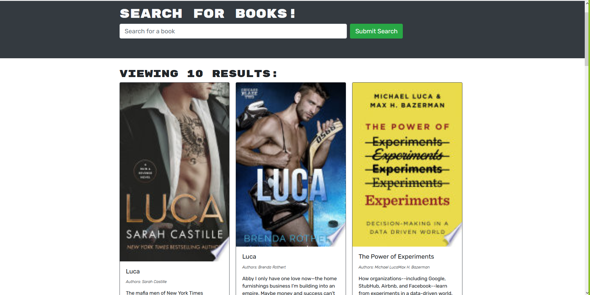
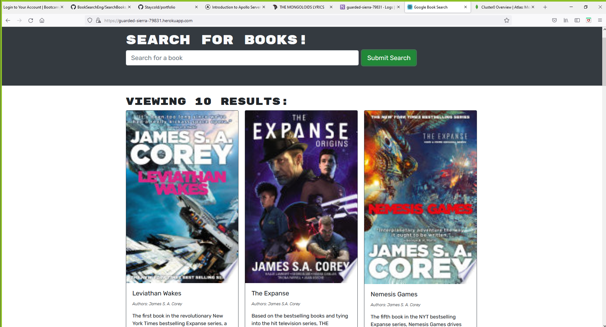
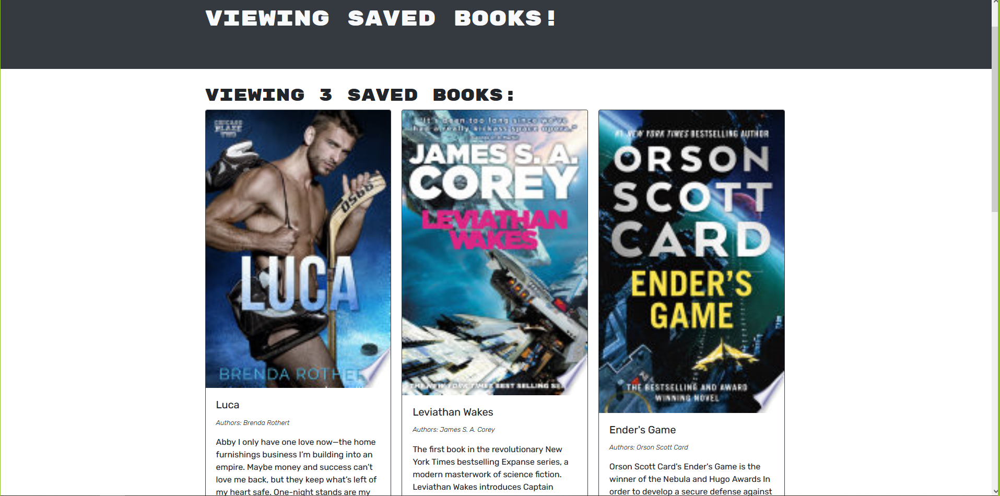

# Booksearch
<h3>
This is the Book SEARCH ENGINE WOOO!!
</h3>

Here, you can create an account to search the googlebooks api and save some books, because books need saving. 

# Table of Contents
*[The Blueprint](#criteria)

*[Intel](#links)

*[Preview](#screenshots)

# Criteria: 
<ul>
<li>GIVEN a book search engine</li>
<li>WHEN I load the search engine
THEN I am presented with a menu with the options Search for Books and Login/Signup and an input field to search for books and a submit button</li>
<li>WHEN I click on the Search for Books menu option
THEN I am presented with an input field to search for books and a submit button</li>
<li>WHEN I am not logged in and enter a search term in the input field and click the submit button
THEN I am presented with several search results, each featuring a book’s title, author, description, image, and a link to that book on the Google Books site</li>
<li>WHEN I click on the Login/Signup menu option
THEN a modal appears on the screen with a toggle between the option to log in or sign up</li>
<li>WHEN the toggle is set to Signup
THEN I am presented with three inputs for a username, an email address, and a password, and a signup button</li>
<li>WHEN the toggle is set to Login
THEN I am presented with two inputs for an email address and a password and login button</li>
<li>WHEN I enter a valid email address and create a password and click on the signup button
THEN my user account is created and I am logged in to the site</li>
<li>WHEN I enter my account’s email address and password and click on the login button
THEN I the modal closes and I am logged in to the site</li>
<li>WHEN I am logged in to the site
THEN the menu options change to Search for Books, an option to see my saved books, and Logout</li>
<li>WHEN I am logged in and enter a search term in the input field and click the submit button
THEN I am presented with several search results, each featuring a book’s title, author, description, image, and a link to that book on the Google Books site and a button to save a book to my account</li>
<li>WHEN I click on the Save button on a book
THEN that book’s information is saved to my account</li>
<li>WHEN I click on the option to see my saved books
THEN I am presented with all of the books I have saved to my account, each featuring the book’s title, author, description, image, and a link to that book on the Google Books site and a button to remove a book from my account</li>
<li>WHEN I click on the Remove button on a book
THEN that book is deleted from my saved books list</li>
<li>WHEN I click on the Logout button
THEN I am logged out of the site and presented with a menu with the options Search for Books and Login/Signup and an input field to search for books and a submit button </li>
</ul>

# Links:

<h3>Github</h3>
<a href="https://github.com/Staycold/Booksearch" target="_blank">https://github.com/Staycold/Booksearch</a>

<h3>HEROKU</h3>
<a href="https://guarded-sierra-79831.herokuapp.com/" target="_blank">https://guarded-sierra-79831.herokuapp.com/ </a>

 
 # Screenshots

 
 
 
